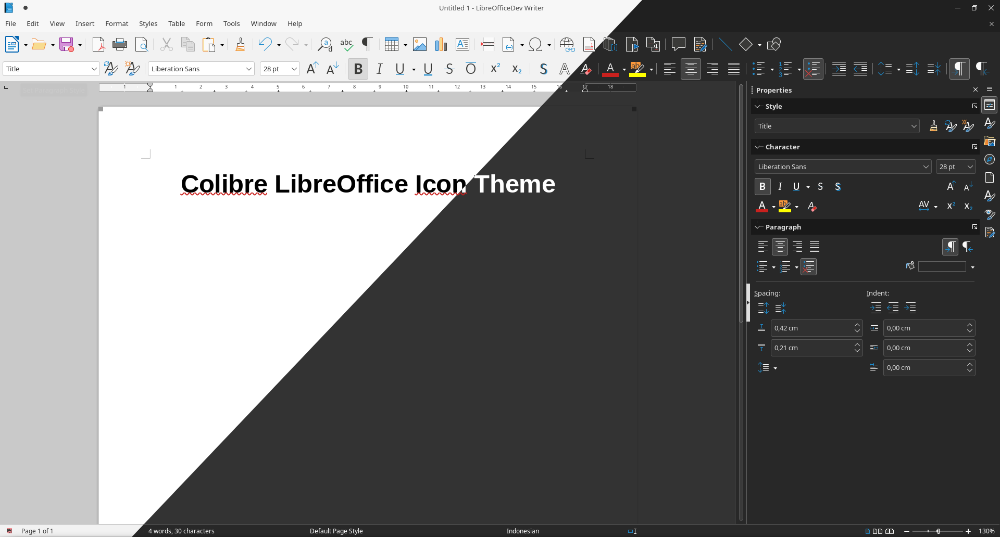

# libreoffice-style-colibre
Colibre Icon Theme for LibreOffice
Colibre is the default icon theme for LibreOffice in Windows as well as in LibreOffice help page. This icon theme is based on the monoline style set by Redmond so that it is hoped that it will make it easier for office application users in general.



## Install
### From extension

Since Libreoffice 6.0, you can install an icon pack with an extension. To do that, simply clone the repository and generate the extension with the build script at the root of the project:

Open it with Libreoffice or, open __Tools__ → __Extension Manager__ (or __Ctrl__ + __Alt__ + __E__) then click on __Add__ and browse for local directory where the extension placed (under build subdirectory).
### From script

⚠ Installing from script do not work when using a confined version of Libreoffice (like snap packages), in that case you must use the extension.

Because it is faster, install from script will be useful if you want to modify the icons and reinstall the pack many times for testing:

```bash
git clone https://github.com/rizmut/libreoffice-style-colibre.git
cd libreoffice-style-colibre
./install-colibre-local.sh
```

⚠ Installing from script and extension will duplicate the icon pack into the options, so you should remove one before using the other way.

---

In any case, you need to enable the theme: open the options __Tools__ → __Options__ (or __Alt__ + __F12__) then go to __LibreOffice__ → __View__ → __Icon style__ and select __Colibre__,  __Colibre (dark)__, __Colibre (SVG)__ or __Colibre (SVG + dark)__ .

## Remove

### From extension

To remove the extension, open __Tools__ → __Extension Manager__ (or __Ctrl__ + __Alt__ + __E__) then select the theme in the list and click on __Remove__. That's it.

### From script

If you want to remove an installation made with the script just execute the remove script at the root of the project:

```bash
./remove-colibre.sh
```
